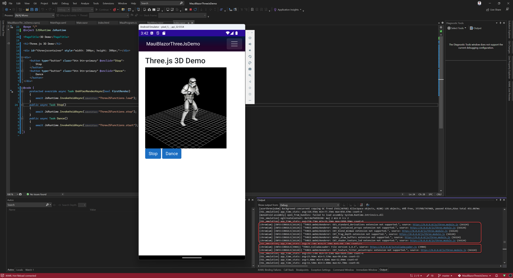

# MauiBlazorThreeJsDemo

Demonstrate **.NET MAUI** + **Hybrid Blazor** + **ThreeJs** loading & render [.dae 3D model](https://www.lifewire.com/dae-file-2620544) file.

Three.js & 3D model resources is from https://romansimuta.com/posts/using-three-js-with-asp-net-core-blazor-server-application/